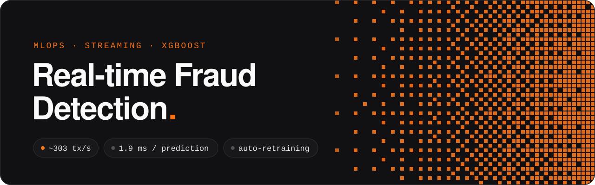
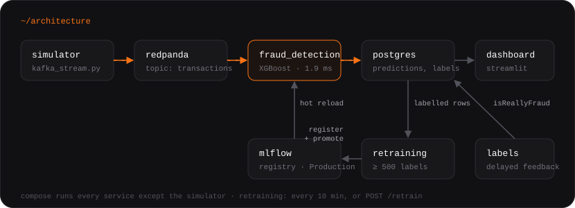

<p></p>

Card transactions stream through Kafka, an XGBoost model scores each one in about 2 ms, and every prediction lands in
PostgreSQL. Once 500 transactions have a confirmed label, the model retrains on them, registers the new version in
MLflow, promotes it to Production and hot-swaps it in the running service. One `docker compose up` runs it all.

<p></p>

https://github.com/user-attachments/assets/fd242d32-32a2-4a61-a250-abe1f54f00ae

## How it works

<p></p>

| Service | What it does |
|---|---|
| `simulate_transactions_stream/` | Replays transactions from the Kaggle credit card dataset into the `transactions` topic, with configurable workers and pace. |
| `fraud_detection/` | Kafka consumer. Scores each transaction with XGBoost and stores the prediction, probability and inference time. Loads the Production model from MLflow, falling back to `data/models/latest_model.json`. |
| `fraud_detection/retrain_api.py` | `POST /retrain` trains on demand. The stream service also checks every 10 minutes. |
| `dashboard/` | Streamlit view of volume, fraud rate, average probability, throughput and latency. |
| Redpanda, PostgreSQL, MLflow | Kafka API, storage, model registry. |

## Results

Measured on one streaming run of 9,692 transactions:

| Metric | Value | Context |
|---|---|---|
| Throughput | ~303 tx/s | Single consumer, single partition. |
| Model inference | 1.92 ms avg | Time of `model.predict` per transaction, not end-to-end latency. |
| Flagged as fraud | 15.78% | The simulator undersamples to 1 fraud per 5 legitimate transactions (16.7% fraud), so this is close to the real share in the stream, not in the wild (0.17%). |
| Precision / recall / F1 after retraining | 1.00 / 0.95 / 0.97 | On a 20% hold-out of the labelled stream data. A small test set: treat it as a smoke test, not a benchmark. |

The model trains with `scale_pos_weight` for class imbalance and is judged on precision, recall and PR-AUC, not
accuracy: on this data, predicting "never fraud" is 99.8% accurate and useless.

<table><tr>
<td></td>
<td></td>
</tr></table>

## Quickstart

Needs Docker and Python 3.11. Download `creditcard.csv` from
[Kaggle](https://www.kaggle.com/datasets/mlg-ulb/creditcardfraud) into `data/raw_data/`.

```bash
# redpanda, postgres, mlflow, scoring service, retrain API, dashboard
docker compose up -d --build

# stream transactions from your machine (Kafka is exposed on localhost:29092)
pip install -r requirements.txt
python simulate_transactions_stream/kafka_stream.py --workers 2 --sleep-time 5

# simulate delayed chargebacks, then retrain now instead of waiting for the 10-minute check
python scripts/label_transactions.py
curl -X POST localhost:8000/retrain
```

Dashboard on [localhost:8501](http://localhost:8501), MLflow on [localhost:5001](http://localhost:5001), retrain API docs
on [localhost:8000/docs](http://localhost:8000/docs).

Postgres credentials and the MLflow experiment name come from `POSTGRES_DB`, `POSTGRES_USER`, `POSTGRES_PASSWORD` and
`MLFLOW_EXPERIMENT` in `.env` (defaults: `fraud_detection`, `postgres`, `postgres`).

## Limitations

- Labels are simulated from the dataset. In production they would come from chargebacks and analyst reviews, days later.
- Once 500 labels exist, the scheduled check retrains every 10 minutes. There is no drift detection deciding when it is worth it.
- `/retrain` has no authentication, and the consumer reads a single partition.
- No automated tests yet.

## License

MIT
